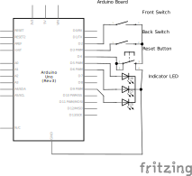

# Antiskid

This program detects when there is too much difference between front wheel and back wheel rotations.

## Schematic

## Compatibility

This code is compatible with any Arduino or compatible board, that meets the following requierements:

- Interrupt on pins 2 and 3, with `FALLING` detection
- `INPUT_PULLUP` mode on pins 2, 3, 4
- `OUTPUT` mode with PWM on pins 5, 6, 9

The Uno and Nano Every boards are tested to be compatible, but any feedback is welcome.

## License

Licensed under either of

 * Apache License, Version 2.0
   ([LICENSE-APACHE](LICENSE-APACHE) or http://www.apache.org/licenses/LICENSE-2.0)
 * MIT license
   ([LICENSE-MIT](LICENSE-MIT) or http://opensource.org/licenses/MIT)

at your option.

## Contribution

Unless you explicitly state otherwise, any contribution intentionally submitted
for inclusion in the work by you, as defined in the Apache-2.0 license, shall be
dual licensed as above, without any additional terms or conditions.
